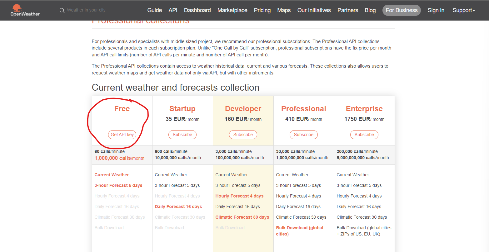
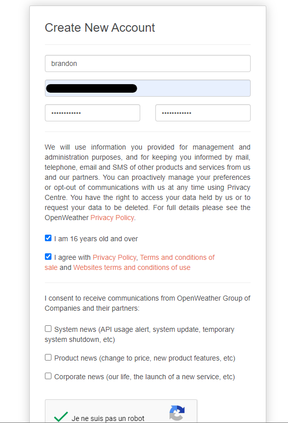
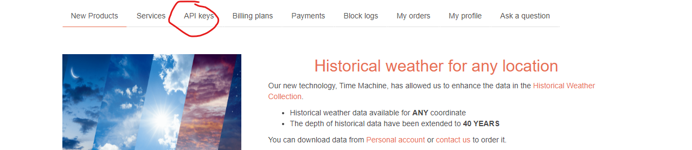
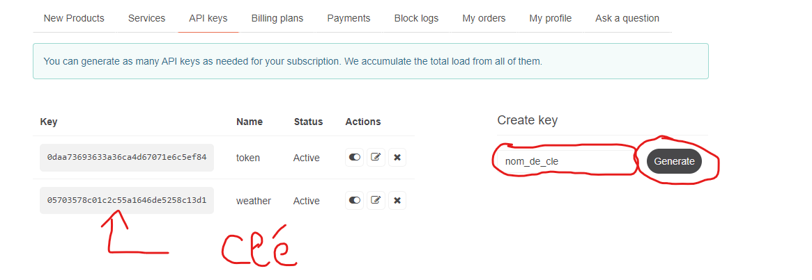

# Exercice 1
## Gestion d'une liste de tâche 

### Objectif : Créez une application de liste de tâches où l'utilisateur peut ajouter, supprimer et marquer des tâches comme terminées.

>Utilisez useState pour gérer la liste des tâches, useReducer pour la gestion des données, et contextAPI pour partager l'état entre différents composants.

# Exercice 2
## Gestion d'un panier d'achat

### Objectif : Créez une application de panier d'achats où l'utilisateur peut ajouter et supprimer des articles du panier, et voir le total des achats.

>Utilisez useReducer pour gérer l'état du panier, useState pour gérer les articles, useEffect pour mettre à jour le total des achats, et contextAPI pour partager l'état du panier entre différents composants.

# Exercice 3
## Formuaire de contact avec validation

### Objectif : Créez un formulaire de contact avec des champs tels que nom, email et message.

>Utilisez useState pour gérer les valeurs des champs, useEffect pour valider les données du formulaire et afficher des messages d'erreur en temps réel. Utilisez également contextAPI pour partager les données du formulaire entre différents composants ainsi que useReducer afin de gérer les valeurs et erreur du formulaire.

# Challenge
## Application de météo

### Objectif : Créez une application de météo qui permet aux utilisateurs de rechercher la météo actuelle d'une ville donnée. 
> Utilisez useState pour gérer les données de la ville, useEffect pour interroger une API météo en temps réel, et contextAPI pour partager les données de la météo entre les différents composants. Affichez la température, les conditions météorologiques, etc.

>Accès à l'api

Récupérer les informations météo sur l'API [OpenWeather](https://openweathermap.org/api),
pour vous créer une clé d'api gratuite pour pouvoir appeler l'api.

 

Créer vous un compte si necessaire (si vous n'en avez pas) 

Une fois connécté rendez-vous dans l'onglet `API Keys`

Saisissez un nom de clé qui sérvira à identifier la clé dans l'input puis cliquez sur `generate` afin d'obtenir votre clé d'api

Une fois ces étapes complétée, vous pourrez envoyer des requêtes en methode GET a l'url "https://api.openweathermap.org/data/2.5/weather?lat={lat}&lon={lon}&appid={API key}"
en remplaçant {lat} par la latitude de la ville, {lon} par la longitude de la ville et {API key} par votre clé d'api 

> La longitude et la latitude d'une ville sont disponibles via l'api de l'état